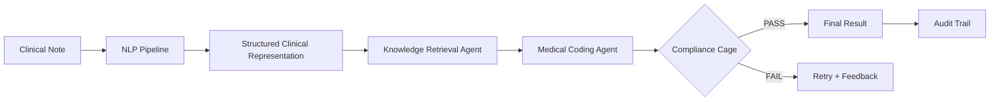

# 🏥 MEDI-COMPLY

**Multi-Agent Healthcare AI System for Clinical Coding, Compliance Verification & Audit Trail Generation**

MEDI-COMPLY is an enterprise-ready, multi-agent AI platform that transforms raw clinical documentation into ICD-10 / CPT codes with *zero-hallucination guarantees*, layered compliance guardrails, and tamper-evident audit trails.

<p align="center">
	
	
	
	
</p>

> **Hackathon-ready differentiator** — Other coders output guesses. MEDI-COMPLY constrains LLMs to verified candidates, enforces 23 guardrails, and records every decision in a hash-chained ledger suitable for regulatory review.

---

## 📋 Table of Contents

- [Architecture Overview](#-architecture-overview)
- [System Pipeline](#-system-pipeline)
- [Module Breakdown](#-module-breakdown)
	- [Task 1 — Core Infrastructure](#task-1--core-infrastructure-core)
	- [Task 2 — Knowledge Base](#task-2--knowledge-base-knowledge)
	- [Task 3 — Clinical NLP Pipeline](#task-3--clinical-nlp-pipeline-nlp)
	- [Task 4 — Knowledge Retrieval Agent](#task-4--knowledge-retrieval-agent-agents)
	- [Task 5 — Medical Coding Agent](#task-5--medical-coding-agent-agents)
	- [Task 6 — Compliance Guardrail Engine](#task-6--compliance-guardrail-engine-guardrails)
	- [Task 7 — Audit Trail System](#task-7--audit-trail-system-audit)
- [Data Models & Schemas](#-data-models--schemas)
- [Quick Start](#-quick-start)
- [Testing](#-testing)
- [Environment Variables](#-environment-variables)
- [Project Statistics](#-project-statistics)
- [Project Structure](#-project-structure)
- [Security Features](#-security-features)
- [Why MEDI-COMPLY?](#-why-medi-comply)
- [License](#-license)

---

## 🏗 Architecture Overview

### Key Design Principles

| Principle | Implementation |
|-----------|----------------|
| **Agent Isolation** | Each agent owns a state machine and communicates via an async message bus. |
| **Deterministic Compliance** | 13 structural + 5 semantic + 5 output checks must pass before release. |
| **Immutable Audit** | SQLite hash chain blocks UPDATE/DELETE, providing tamper evidence. |
| **LLM Containment** | The coding agent can *only* choose from pre-verified candidates. |
| **Graceful Degradation** | Keyword / rule fallbacks kick in if the LLM or vector store is offline. |

### High-Level Block Diagram

```
┌────────────────────────────────────────────────────────────────────┐
│                        MEDI-COMPLY SYSTEM                          │
│                                                                    │
│  Clinical Note → NLP Pipeline → Knowledge Retrieval → Coding Agent │
│                                 │                                  │
│                                 ▼                                  │
│                    Compliance Cage (Layers 3/4/5)                  │
│                                 │                                  │
│                              Final Output                          │
│                                 │                                  │
│                           Audit Trail Store                        │
└────────────────────────────────────────────────────────────────────┘
```

---

## 🔄 System Pipeline



1. **Ingestion** — DocumentIngester fingerprints, sanitizes, and partitions notes.
2. **NLP Extraction** — Section parsing, entity extraction, assertion typing, SCR build.
3. **Retrieval** — Direct map + vector + keyword + hierarchy + guideline strategies.
4. **Coding** — LLM & rule hybrid chooses ICD-10/CPT with sequencing + combo logic.
5. **Compliance** — 23 multi-layer checks block unsafe output, trigger retries/escalations.
6. **Audit** — Evidence links, risk scores, and hash-chained ledger captured per trace.

---

## 📦 Module Breakdown

### Task 1 — Core Infrastructure (`core/`)

| File | Purpose |
|------|---------|
| `agent_base.py` | Base class with async `handle()`, state transitions, telemetry hooks. |
| `state_machine.py` | Enforces legal lifecycle transitions and retry escalation. |
| `message_bus.py` | Async pub/sub with dead-letter queue + request/response helpers. |
| `message_models.py` | Pydantic models for messages, responses, priorities. |
| `config.py` | Typed settings via Pydantic v2. |
| `logger.py` | Structured logging utilities. |
| `llm_client.py` | Provider-agnostic LLM wrapper (OpenAI/Anthropic/Ollama/mock). |

### Task 2 — Knowledge Base (`knowledge/`)

| File | Purpose |
|------|---------|
| `icd10_db.py` / `icd10_database.py` | ICD-10 CM lookup, hierarchy, Excludes matrices. |
| `cpt_db.py` | CPT/HCPCS lookup with RVU/meta data. |
| `ncci_engine.py` | NCCI edit validation + MUE enforcement. |
| `knowledge_manager.py` | Unified facade + keyword/vector search fallbacks. |
| `vector_store.py` | Chroma-backed semantic search with health checks + normalization. |
| `seed_*` scripts | Deterministic seeding of ICD-10/CPT/NCCI datasets. |

### Task 3 — Clinical NLP Pipeline (`nlp/`)

| File | Purpose |
|------|---------|
| `clinical_nlp_pipeline.py` | Master pipeline orchestrating detectors, extractors, classifiers. |
| `scr_builder.py` | Produces `StructuredClinicalRepresentation` objects. |
| `section_parser.py` | Lightweight rule/regex segmentation into HPI, Assessment, etc. |
| `entity_linker.py` / `clinical_ner.py` | Maps terms to canonical concepts. |
| `negation_detector.py` | Assertion detection (PRESENT, ABSENT, POSSIBLE, HX). |
| `evidence_tracker.py` | Tracks page/line offsets for later audit linking. |

### Task 4 — Knowledge Retrieval Agent (`agents/`)

| Component | Purpose |
|-----------|---------|
| `retrieval_strategies.py` | Direct map, vector RAG, keyword, hierarchy traversal, fusion. |
| `knowledge_retrieval_agent.py` | Aggregates strategies, deduplicates, ranks, annotates metadata. |
| `context_assembler.py` | Builds retrieval context (clinical focus, guidelines, conflicts). |

### Task 5 — Medical Coding Agent (`agents/`)

| Component | Purpose |
|-----------|---------|
| `medical_coding_agent.py` | Coordinates LLM decision engine, sequencing, compliance feedback. |
| `coding_decision_engine.py` | LLM prompting + rule fallback for each code family. |
| `coding_prompts.py` | System/user prompt templates with guardrailed instructions. |
| `sequencing_engine.py` | Principal DX, manifestation ordering, combination logic. |
| `combination_code_handler.py` | Detects Use Additional / Code First dependencies. |
| `confidence_calculator.py` | Multi-factor scoring (evidence strength, guideline support, risk). |

### Task 6 — Compliance Guardrail Engine (`guardrails/`)

| Layer | Checks | Highlights |
|-------|--------|------------|
| **Layer 3 – Structural** | 13 | Code validity, NCCI edits, Excludes, age/gender, laterality, MUE, billable-level enforcement. |
| **Layer 4 – Semantic** | 5 | Evidence sufficiency, upcoding detection, clinical consistency, guideline adherence, documentation quality. |
| **Layer 5 – Output** | 5 | JSON contract validation, packaging completeness, downstream compatibility, final confidence gate, human review flags. |

Supporting files: `layer3_structural.py`, `layer4_semantic.py`, `layer5_output.py`, `guardrail_chain.py`, `compliance_report.py`, `feedback_generator.py`, `security_guards.py`.

### Task 7 — Audit Trail System (`audit/`)

| File | Purpose |
|------|---------|
| `audit_models.py` | Pydantic models for workflow traces, evidence links, reports. |
| `hash_chain.py` | SHA-256 linked records + verification utilities. |
| `audit_store.py` | Immutable SQLite store (no UPDATE/DELETE). |
| `decision_trace.py` | Captures stage timings, errors, retries. |
| `evidence_mapper.py` | Bidirectional mapping between codes and documentation snippets. |
| `risk_scorer.py` | Returns LOW → CRITICAL risk levels. |
| `report_generator.py` | Narrative summaries, code cards, compliance certificate, JSON export. |

---

## 📐 Data Models & Schemas

Located in `medi_comply/schemas/`:

- `coding_result.py` — `CodingResult`, `SingleCodeDecision`, `ReasoningStep`, etc.
- `compliance.py` — `ComplianceCheck`, `ComplianceResult`, `GuardrailDecision` enums.
- `retrieval.py` — `CodeRetrievalContext`, `ConditionCodeCandidates`, `RankedCodeCandidate`.
- `audit.py` — `AuditRecord`, `WorkflowTrace`, `RiskScore`, `EvidenceLink`.
- `clinical.py` | `common.py` | `claims.py` | `coding.py` — supporting clinical + workflow schemas.

---

## 🚀 Quick Start

### 1. Clone & Setup

```bash
git clone https://github.com/<your-org>/MEDI-COMPLY.git
cd MEDI-COMPLY
python -m venv .venv
.venv\\Scripts\\activate   # macOS/Linux: source .venv/bin/activate
pip install -r medi_comply/requirements.txt
```

### 2. Configure Environment

```bash
cp medi_comply/.env.example medi_comply/.env
# edit medi_comply/.env with keys (OPENAI_API_KEY, KNOWLEDGE_VECTOR_DB_URL, etc.)
```

### 3. Initialize Knowledge Base (optional)

```bash
python -m medi_comply.knowledge.seed_data
```

### 4. Run Streamlit Demo

```bash
streamlit run medi_comply/demo_app.py
```

### 5. Launch FastAPI Service

```bash
cd medi_comply
uvicorn main:app --reload --host 0.0.0.0 --port 8000
```

### 6. Docker (optional)

```bash
cd medi_comply
docker compose up --build
```

---

## 🧪 Testing

Full suite (103 tests):

```bash
python -m pytest medi_comply/tests/test_golden_suite.py \
							 medi_comply/tests/test_end_to_end.py -v
```

Focused runs:

```bash
python -m pytest medi_comply/tests/test_core.py -v
python -m pytest medi_comply/tests/test_guardrails.py -v
python -m pytest medi_comply/tests/test_retrieval.py -v
```

Coverage / debugging aids:

```bash
python -m pytest medi_comply/tests/ --cov=medi_comply --cov-report=html
```

`run_demo.py --tests-only` automates the golden suite prior to live demos.

---

## ⚙️ Environment Variables

| Variable | Default | Description |
|----------|---------|-------------|
| `APP_NAME` | `MEDI-COMPLY` | Application label. |
| `ENVIRONMENT` | `development` | `development` / `staging` / `production`. |
| `LOG_LEVEL` | `INFO` | Logging verbosity. |
| `DATABASE_URL` | — | Postgres connection for audit/metadata (optional). |
| `REDIS_URL` | — | Redis for caching / queues. |
| `LLM_MODEL_NAME` | `gpt-4o` | Primary LLM. |
| `LLM_TEMPERATURE` | `0.1` | Determinism vs creativity. |
| `LLM_MAX_TOKENS` | `4096` | Max response tokens. |
| `LLM_API_KEY` | — | Provider credential. |
| `GUARDRAIL_CONFIDENCE_THRESHOLD` | `0.85` | Minimum confidence before FAIL/ESCALATE. |
| `GUARDRAIL_MAX_RETRIES` | `3` | Auto retry attempts. |
| `GUARDRAIL_ESCALATION_THRESHOLD` | `0.7` | Trigger for manual review. |
| `KNOWLEDGE_VECTOR_DB_URL` | `http://localhost:8100` | Chroma endpoint. |
| `AUDIT_RETENTION_DAYS` | `2555` | ~7 years retention. |
| `SECURITY_ENABLE_PHI_DETECTION` | `true` | Prompt PHI scanning toggle. |
| `SECURITY_ENABLE_PROMPT_INJECTION_DETECTION` | `true` | Prompt safety toggle. |

---

## 📊 Project Statistics

```
┌────────────────────┬─────────┬────────────┐
│ Module             │ Files   │   Lines    │
├────────────────────┼─────────┼────────────┤
│ core/              │   7     │     900+   |
│ knowledge/         │  13     │   2,000+   |
│ nlp/               │  11     │   2,800+   |
│ agents/            │  12     │   2,400+   |
│ guardrails/        │   7     │   1,000+   |
│ audit/             │   9     │   2,300+   |
│ schemas/           │  10     │   1,000+   |
│ tests/             │   8     │   1,600+   |
├────────────────────┼─────────┼────────────┤
│ TOTAL              │  77     │  ~13,000+  |
└────────────────────┴─────────┴────────────┘
```

- **ICD-10 Codes Seeded:** 3,000+
- **CPT Codes Seeded:** 500+
- **Compliance Checks:** 23
- **Automated Tests:** 103 (golden suite + e2e)

---

## 📁 Project Structure

```
MEDI-COMPLY/
├── medi_comply/
│   ├── core/                 # Task 1 foundation (agents, bus, config, LLM)
│   ├── knowledge/            # Task 2 knowledge base + vector store
│   ├── nlp/                  # Task 3 clinical NLP pipeline
│   ├── agents/               # Task 4/5 retrieval + coding agents
│   ├── guardrails/           # Task 6 compliance cage
│   ├── audit/                # Task 7 audit ledger + reports
│   ├── api/                  # FastAPI routes & converters
│   ├── demo_app.py           # Streamlit judge UI
│   ├── system.py             # MediComplySystem orchestrator
│   └── requirements.txt      # Python deps
├── tests/                    # pytest suites (core, nlp, retrieval, guardrails, audit)
├── run_demo.py               # One-click (tests + Streamlit) launcher
├── README.md                 # This document
└── medi_comply/.env.example  # Config template
```

---

## 🔐 Security Features

- **PHI Detection** — Ensures prompts routed to external LLMs are scrubbed.
- **Prompt-Injection Guards** — Blocks adversarial instructions before execution.
- **Hash-Chained Ledger** — Every audit record references the previous hash.
- **Immutable Storage** — SQLite triggers forbid UPDATE/DELETE on audit tables.
- **LLM Containment** — No free-form generation; only curated candidates allowed.
- **Digital Signatures** — Audit records include fingerprints for downstream verification.

---

## 🏆 Why MEDI-COMPLY?

| Capability | MEDI-COMPLY | Typical AI Coder |
|------------|-------------|------------------|
| Hallucination prevention | ✅ Candidate-constrained | ❌ Free text |
| Compliance verification | ✅ 23 checks, multi-layer | ⚠️ Manual spot checks |
| Audit readiness | ✅ Hash-chained, immutable | ⚠️ CSV export |
| Rule fallback | ✅ Deterministic backup | ❌ LLM-only |
| Evidence traceability | ✅ Section/page/line links | ⚠️ Opaque |
| Retry engine | ✅ Auto feedback + escalation | ❌ Manual fix |

---

## 📄 License

MIT License © 2026 MEDI-COMPLY Team.

<p align="center">
	<strong>Built for the Healthcare AI Hackathon 🏥🤖</strong><br/>
	<em>Compliance isn’t optional — it’s guaranteed.</em>
</p>